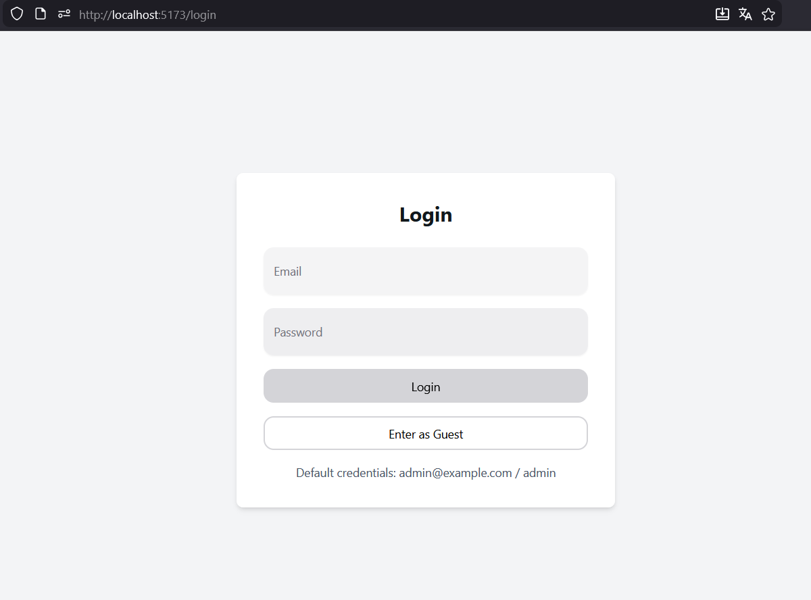
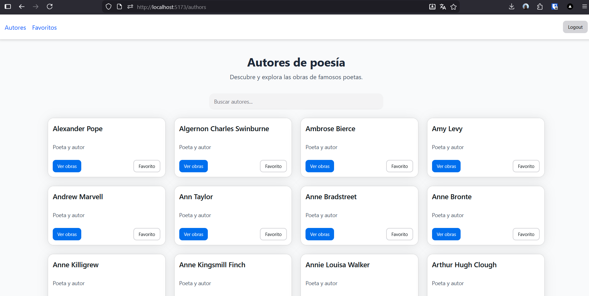
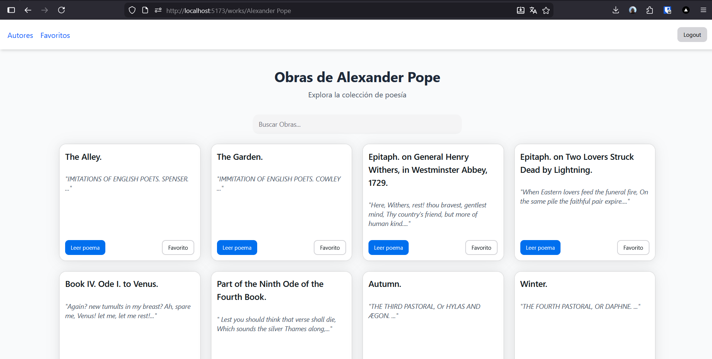
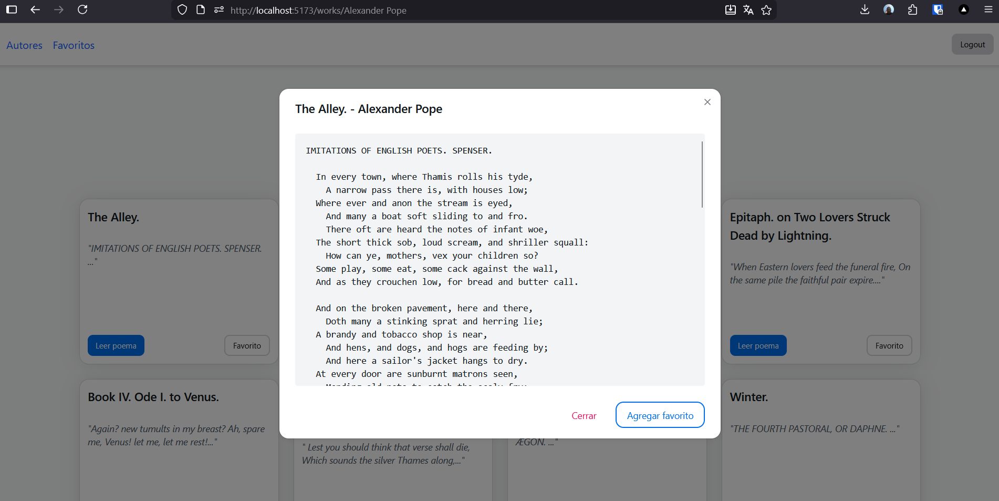
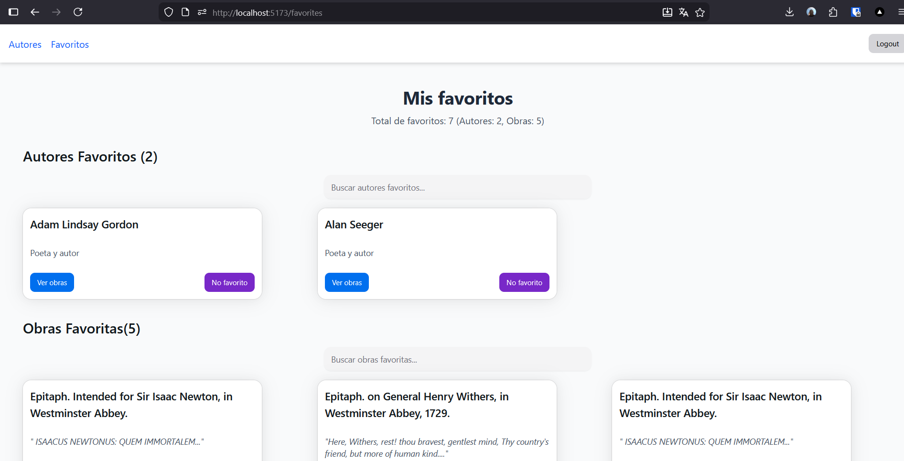
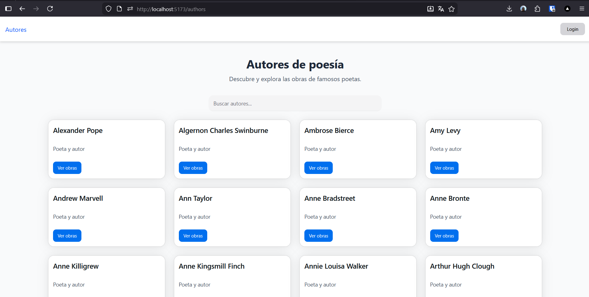
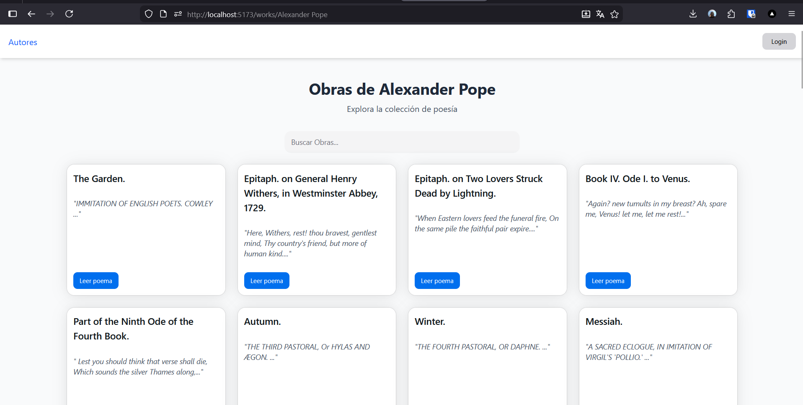

# Poetry App - Prueba Técnica React

Aplicación web para explorar poesía, con funcionalidades de autenticación, listado de autores, obras y poemas, sistema de favoritos y modo invitado.

## Descripción del Proyecto

Esta aplicación permite a los usuarios explorar una colección de poesía a través de la API de PoetryDB. Incluye:

- **Autenticación**: Login con credenciales por defecto y modo invitado
- **Exploración**: Listado de autores, selección de obras y lectura de poemas
- **Favoritos**: Guardar autores y obras favoritas (solo usuarios autenticados)
- **Interfaz moderna**: Diseño responsivo con componentes reutilizables
- **Accesibilidad**: Etiquetas semánticas y soporte para lectores de pantalla

## Tecnologías Utilizadas

### Frontend
- **React**: 18.3.1
- **TypeScript**: 5.6.3
- **Vite**: 6.0.11
- **React Router DOM**: 6.23.0

### UI/Estilos
- **HeroUI**: 2.2.x (componentes UI)
- **TailwindCSS**: 4.1.11
- **Tailwind Variants**: 3.2.2
- **Framer Motion**: 11.18.2

### Desarrollo
- **ESLint**: 9.25.1
- **Prettier**: 3.5.3
- **Vite TSConfig Paths**: 5.1.4

### API
- **PoetryDB API**: https://poetrydb.org

## Instrucciones para el Levantamiento

### Prerrequisitos
- Node.js (versión 18 o superior)
- npm, yarn, pnpm o bun

### Instalación

1. Clona el repositorio:
```bash
git clone <url-del-repositorio>
cd prueba-tecnica-react
```

2. Instala las dependencias:
```bash
npm install
```

3. Inicia el servidor de desarrollo:
```bash
npm run dev
```

4. Abre tu navegador en `http://localhost:5173`

### Credenciales por Defecto
- **Usuario**: admin@example.com
- **Contraseña**: admin

### Modo Invitado
Puedes acceder como invitado para explorar las funcionalidades básicas sin autenticación.

## Funcionalidades

- ✅ Login con credenciales por defecto
- ✅ Modo invitado
- ✅ Listado de autores con búsqueda
- ✅ Exploración de obras por autor
- ✅ Lectura de poemas completos en modal
- ✅ Sistema de favoritos (autores y obras)
- ✅ Interfaz responsiva
- ✅ Accesibilidad con etiquetas semánticas

## Capturas del Funcionamiento

### Login

### Lista de Autores

### Obras por Autor

### Poemas

### Favoritos

### Lista de Autores (Invitados)

### Obras (Invitados)


## Estructura del Proyecto

```
src/
├── app/                 # Configuración de la app
├── features/           # Funcionalidades por dominio
│   ├── auth/          # Autenticación
│   ├── authors/       # Gestión de autores
│   ├── works/         # Gestión de obras/poemas
│   └── favorites/     # Sistema de favoritos
├── shared/            # Código compartido
│   ├── api/          # Cliente API
│   ├── auth/         # Contexto de autenticación
│   ├── storage/      # Gestión de localStorage
│   ├── types/        # Tipos TypeScript
│   └── ui/           # Componentes reutilizables
└── styles/           # Estilos globales
```

## Licencia

Este proyecto es parte de una prueba técnica y está bajo la Licencia MIT.
